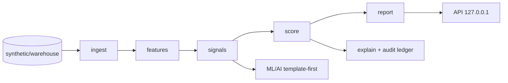
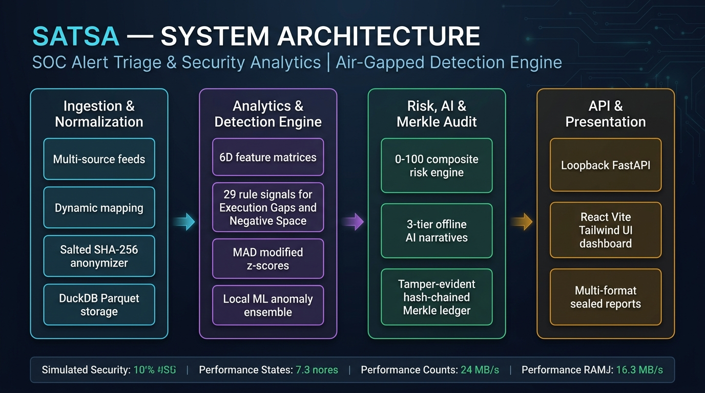

# SATSA Architecture (2 pages)

SOC Alert Triage & Security Analytics: air-gapped detection of execution
gaps and negative space across CSE triage feeds, with template-first
narratives and a hash-chained audit trail.

## Component overview

## Data flow (ingest→features→signals→score→report)

Raw CSE submissions are validated and quarantined (`ingest`), normalised
to canonical parquet (`canonical`), featurised per alert/case/analyst
(`features`: temporal, workflow, text, coverage, asset, entity vectors),
matched against 29 rule signals with peer benchmarking and anomaly
ensembling (`signals`), composited into 0–100 domain-weighted risk with
confidence gating (`score`), then narrated, rendered (HTML/PDF/CSV/XLSX)
and sealed with a Merkle manifest (`report`, `audit_seal`). The
orchestrator checkpoints every stage; re-runs skip matching markers.

## Deployment topology

Single box (venv + `data/`), Docker (`network_mode: none`, read-only root
FS, uid 1000, `/data /models /configs` volumes), or full air-gap via the
offline bundle (`scripts/build_offline_bundle.sh` → `install_offline.sh`).

## Offline/AI posture

Three LLM modes: (1) template-only default — deterministic narratives,
zero model files; (2) local GGUF via llama-cpp; (3) Ollama on
127.0.0.1:11434 only. With all backends disabled every narrative,
prompt, and report still renders (guardrails + template fallback), and
`verify_airgap.sh` proves zero external connections.

## Security posture

No network (loopback-only clients, pinned hosts, strace gate in CI);
analyst IDs are salted SHA-256 (`analyst_salt`); manifests HMAC-signed
(`manifest_key`); ledger hash-chained with Merkle roots; container runs
read-only as non-root; secrets never read from `*_API_KEY`/`*_SECRET`
env (asserted by the air-gap gate).
