# SATSA — SOC Alert Triage & Security Analytics

Air-gapped detection of SOC execution gaps and negative space, with
explainable findings and a tamper-evident audit trail.


## Technical Architecture & Design

```mermaid
flowchart LR
    subgraph L1["1. Ingestion & Air-Gap"]
        IN1["6 Canonical Tables\n(Alerts, Cases, Investigations,\nEscalations, Assets, Telemetry)"]
        IN2["Dynamic YAML Mapping &\nSalted SHA-256 Anonymizer"]
        IN3["Canonical Parquet\n(DuckDB / Local Storage)"]
        IN1 --> IN2 --> IN3
    end

    subgraph L2["2. Feature & Detection Engine"]
        F1["6D Feature Matrices\n(Temporal, Workflow, NLP, Graph)"]
        F2["29 Rule Signals\n(14 EG + 12 NS + 3 COMP)"]
        F3["MAD Modified Z-Scores &\nIsolation Forest Ensemble"]
        IN3 --> F1 --> F2 --> F3
    end

    subgraph L3["3. Scoring, AI & Merkle Audit"]
        S1["0–100 Composite Risk Engine\n& S10 Confidence Gate"]
        S2["3-Tier Offline AI Narrator\n(Template Engine / GGUF)"]
        S3["Tamper-Evident Ledger\n(Hash-Chained Merkle Roots)"]
        F3 --> S1 --> S2
        S1 --> S3
    end

    subgraph L4["4. Presentation & Delivery"]
        P1["Loopback FastAPI\n(127.0.0.1:8080)"]
        P2["React 18 + Vite UI\n(Portfolio, Queue, Entity)"]
        P3["Sealed Multi-Reports\n(HTML, PDF, CSV, XLSX)"]
        S2 --> P1 --> P2
        S3 --> P3
    end
```



### Architectural Pillars (Technical POV)

1. **Air-Gapped Ingestion & Privacy Boundary**:
   - Ingests 6 canonical tables across CSV, JSONL, Parquet, SQLite, and DuckDB formats.
   - Dynamic schema mapper (`configs/mappings`) resolves field drifts automatically.
   - Privacy-preserving analyst hashing using salted SHA-256 tokens (`analyst_salt`).
   - Strict row quarantine (`data/quarantine/*.jsonl`) isolates malformed rows.

2. **High-Performance Analytics & Hybrid Detection**:
   - In-memory zero-copy columnar querying via DuckDB & Apache Parquet.
   - Multi-dimensional feature extraction: triage MTTR, burst closes, re-open rates, text similarity, and 12-week seasonality detrending.
   - 29 Deterministic Rule Signals (14 Execution Gaps + 12 Negative Space + 3 Composite).
   - Statistical peer benchmarking (Median Absolute Deviation modified z-scores with Benjamini-Hochberg FDR correction) ensembled with local Isolation Forests & DBSCAN.

3. **Risk Scoring, Offline AI & Merkle Audit**:
   - Calibrated 0–100 domain-weighted composite risk scoring with confidence gating and S10 partial-feed isolation.
   - 3-Tier Offline AI Narrator: Mode 1 Deterministic Templates (zero model files, default), Mode 2 Local GGUF via `llama-cpp`, Mode 3 Local Ollama on loopback.
   - Cryptographic tamper-evident audit ledger (`audit_ledger.jsonl`) with sequential SHA-256 hash chains, Merkle root verification, and HMAC-signed manifests.

4. **Hardened Loopback API & Modern Client UI**:
   - FastAPI backend bound strictly to `127.0.0.1:8080` (verified zero outbound network sockets).
   - React 18 + TypeScript + Vite + Tailwind CSS dashboard with live queue triage, entity deep-dives, audit chain inspection, and benchmark comparisons.
   - Multi-format sealed report generators emitting interactive HTML, PDF, CSV, and XLSX workbooks.

Architecture reference: see [ARCHITECTURE.md](ARCHITECTURE.md).

## 5-command quickstart

```bash
cp .env.example .env   # edit keys
make scaffold
make seed-demo
.venv/Scripts/python.exe -W ignore -m satsa.pipeline.orchestrator --run-id demo
.venv/Scripts/python.exe -W ignore -m satsa.audit.runner verify
```

First report: `data/curated/reports/demo/portfolio_report.html`.

## CLI reference

`cli.py` ships scaffold/seed-demo live; pipeline stages run as module
entry points (frozen-CLI policy since Phase 0):

| Command | Module equivalent |
|---|---|
| `satsa scaffold` | `python -m satsa.cli scaffold` |
| `satsa seed-demo` | `python -m satsa.cli seed-demo` |
| `satsa ingest --cse-id X` | `python scripts/seed_demo_data.py` (demo corpora) |
| `satsa run` | `python -m satsa.pipeline.orchestrator --run-id demo [--force]` |
| `satsa signals` | `python -m satsa.signals.runner --all` |
| `satsa score` / `prioritise` | `python -m satsa.scoring.risk_engine` / `satsa.scoring.prioritisation` |
| `satsa narrate` | `python -m satsa.ai.narrate --entity <id>` / `--all` |
| `satsa explain --finding-id` | `python -m satsa.explain.runner --finding-id <id>` |
| `satsa audit verify` / `export` | `python -m satsa.audit.runner verify` / `export --run-id <id>` |
| `satsa validate --labels` | `python -m satsa.validation.benchmark --labels <parquet>` |
| `satsa serve` | `python -m satsa.api.main --port 8080` |

## Config guide (new CSE)

1. Add the CSE block to `configs/entity_registry.yaml` (sector, size,
   environment, cohort).
2. Add severity/threshold overrides in `configs/thresholds.yaml`
   (or accept Phase defaults).
3. Drop raw submissions under `data/raw/<cse>/`, run ingest/validate,
   then re-run the pipeline.

## FAQ

1. Does it need the network? No — verified by `scripts/verify_airgap.sh`.
2. Does it need a GPU/LLM? No — template mode is the default; GGUF/Ollama optional.
3. Where do reports land? `data/curated/reports/<run_id>/`.
4. How do I verify integrity? `python -m satsa.audit.runner verify` + manifest HMAC.
5. S10 scores segregated — why? Partial-feed completeness < 0.6 → separate queue by design.
6. Can thresholds change themselves? Never — human edits only (ADR-009).
7. How are analysts anonymised? Salted SHA-256 64-hex IDs.
8. Which Python? 3.11+ (3.13 used here); Ubuntu 22.04 recommended.
9. How long is a full run? ~1 min on synthetic data (budget: < 15 min).
10. Where is the API token? Off by default; see `configs/api.yaml`.

## Troubleshooting (top 5)

1. `ModuleNotFoundError: satsa` → install with `pip install -e .` in the venv.
2. Empty queue / no findings → check `data/synthetic/<cse>/` parquets exist; re-run seed-demo.
3. Ledger verify FAIL → check for manual edits; JSONL is source of truth; restore from archive.
4. `verify_airgap.sh` FAIL on URLs → allowlist is 127.0.0.1/localhost/example-models.local only.
5. PDF missing → WeasyPrint/reportlab absent is fine; the builtin writer still emits a valid PDF.

## Project layout

```text
client/                 React/Vite frontend
server/src/satsa/       Python API, analytics, AI/ML, ingestion, and pipeline
configs/                Offline mappings and thresholds
data/                   Private inputs, quarantine, reports, and audit stores
models/                 Local ML artifacts only
tests/                  Backend and integration tests
```

The old `ui/` path is no longer used; run frontend commands from `client/`.

## Website workflow

Prerequisites: Node.js 20+, npm 10+.
Quick start (5 commands from zero to running UI):

```bash
cd client && npm install
npm run typecheck && npm run lint
npm run test
npm run build
npm run dev     # http://127.0.0.1:3000 (proxies /api to :8080)
```

In a second terminal, start the backend from the repository root:

```bash
python -m satsa.api.main --port 8080
```

Use the website in this order:

1. **Settings**: enter a company identifier, select `alerts`, `cases`,
   `investigations`, `escalations`, `assets`, and `telemetry` files, then select
   **Upload and Analyze**.
2. **Portfolio**: the site automatically opens the uploaded run, shows its
   processing state, and refreshes when analysis completes.
3. **Queue**: review prioritized entities and signals.
4. **Entities**: open an entity to inspect scores, findings, and evidence.
5. **Audit**: verify the append-only audit chain and inspect event history.
6. **Runs**: compare available runs and open a previous report.
7. **Validation**: inspect precision, recall, scenarios, and disagreements when
   a validation report exists.
8. **Settings**: configure the local API token and display preferences.

Development: `npm run dev` (Vite dev server with HMR).
Production: `npm run build` (outputs to `dist/`); after building, open
http://127.0.0.1:8080 — `satsa serve` (and the API server) mounts
`ui/dist` at `/` with SPA fallback.
Testing: `npm run test` (Vitest + MSW, offline).
Offline verification: `bash scripts/verify_ui_airgap.sh` (zero external
URLs in `dist/`; also runs as part of `scripts/verify_airgap.sh`).
Browser support: Chrome 120+ / Firefox 121+ / Edge 120+ (workstation only).

## Private CSE submissions

Place a submission in a private local folder with files named after the
canonical tables, for example `alerts.csv`, `cases.jsonl`, `investigations.parquet`,
`escalations.csv`, `assets.csv`, and `telemetry.csv`. SQLite and DuckDB exports
are also accepted when their table names match those six names. Nothing is sent
outside the workstation.

Create a mapping when source columns differ from the canonical schema, then run:

```bash
python -m satsa.cli ingest --source D:\private\acme-submission --cse-id acme_finance --run-id acme-2026-09
python -m satsa.pipeline.orchestrator --run-id acme-2026-09
python -m satsa.audit.runner verify
```

The same workflow is available in the UI: open **Settings**, enter the company
identifier, choose the table files, and select **Upload and Analyze**. The UI
posts only to the loopback API; after processing, select the returned run in
**Portfolio**.

When no `configs/mappings/<cse-id>.yaml` exists, SATSA automatically recognizes
common export names such as `alert_timestamp`, `severity`, `priority`,
`alert_name`, `asset_id`, `case_id`, `opened_at`, and `closed_at`. A mapping
file is still recommended when the source uses unusual names or custom enum
values.

Invalid rows are retained in `data/quarantine/<cse-id>.jsonl`; valid rows are
materialized locally under `data/synthetic/<cse-id>/`. The audit API treats the
append-only `data/warehouse/audit_ledger.jsonl` as authoritative and repairs a
stale DuckDB mirror after confirming the source chain is valid.
