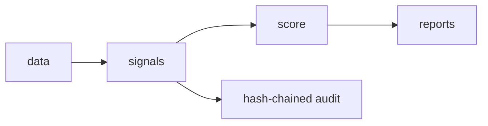
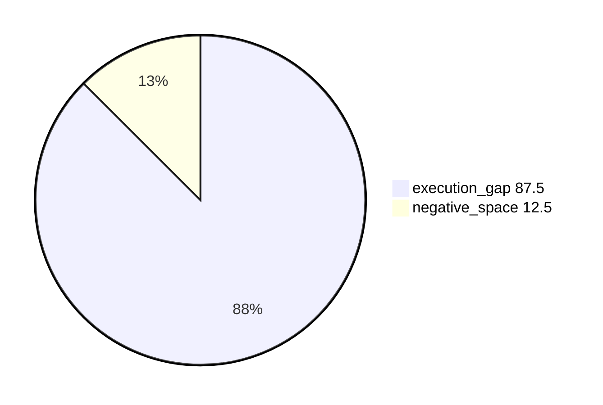
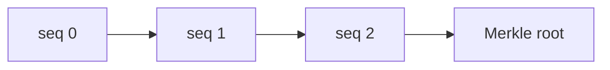

# SATSA technical presentation (5 slides)

## Slide 1 — Problem

Manual SOC review samples blindly and misses two failure classes:
execution gaps (work done badly: premature closes EG-001, batch closes
EG-006, bypassed escalation EG-003) and negative space (work invisible:
dark critical assets NS-001, silent estates NS-010, truncated feeds
NS-012). Example: 150 cases closed by one analyst in 20 seconds reads as
"productive" in a ticket queue — EG-006 flags the burst shape instead.

## Slide 2 — Architecture + offline/AI posture

| Mode | Backend | Behaviour |
|---|---|---|
| 1 template (default) | none | deterministic narratives, zero assets |
| 2 local GGUF | llama-cpp | richer drafts, guardrailed |
| 3 Ollama | 127.0.0.1 only | same, daemon-backed |

No mode touches the network; every output renders in mode 1.

## Slide 3 — Signal library + methodology (the IP)

14 EG + 12 NS + 3 COMP signals (see SIGNAL_CATALOGUE.md). Peer
benchmarking with MAD-based modified z-scores (robust to outliers);
Benjamini-Hochberg FDR across 12 peer metrics; 12-week detrending for
seasonality. Ablation on synthetic truth: execution_gap 87.5%,
negative_space 12.5%, composite 0.0% (compositional, fires with members).

## Slide 4 — Explainability, audit, validation

Every finding: reason code + evidence/counter-evidence + counterfactual
+ confidence + ledger entry. Hash chain:

Validation on synthetic truth: recall 0.80 overall, S2 recall 1.0,
precision@10 reported per run, Cohen's kappa reported per run.

## Slide 5 — Deployment, scalability, roadmap

| CSEs × alerts | Hardware |
|---|---|
| ≤10 × 200 (demo) | 4c / 8 GB |
| ≤50 × 5k (min) | 8c / 32 GB / 500 GB |
| ≤200 × 50k (rec) | 16c / 64 GB / 2 TB |
| 1000+ (large) | 32c / 128 GB / 8 TB |

Air-gap bundle (`build_offline_bundle.sh`) + `network_mode: none`
containers. Roadmap: real NCIIPC label validation, threshold review from
adjudications, multi-window trend reports, role-based API access.
